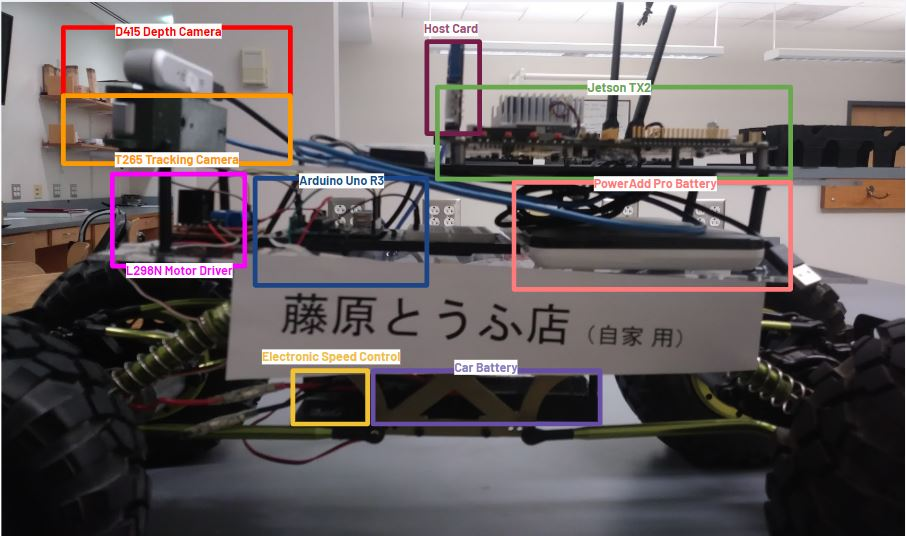
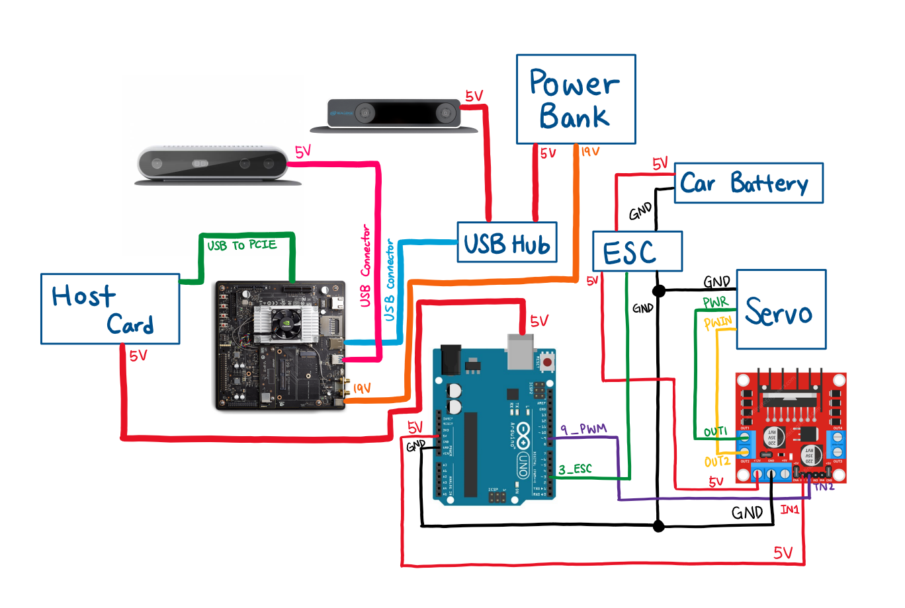

# Hardware  

#### Contents

1. [Hardware Overview](#hardware-overview)
2. [Project Hardware Components](#hardware-components)
3. [How to Set Up](#set-up)
4. [Hardware Diagram](#hardware-diagram)
5. [CAD File for Camera Mount](#cad-files)

<a name="hardware-overview"/>

## 1. Hardware Overview

The rover is a Traxxas 1/8th 4WD Electric Power R/C Rock Crawler with front and rear stepper motors, an electronic speed controller (ESC), a differential steering servo for the front axis, and a 7.2V, 2000mAh LiPo battery for powering the rover.

The main computer that performs image processing and makes smart decisions for the Mars rover is the Nvidia Jetson TX2. An Arduino Uno R3 acts as the microcontroller which drives the ESC and motors on the rover and interfaces with all other sensors for movement.

An Intel Realsense D415 Depth Camera and Intel RealSense T265 Tracking Camera are used in tandem to detect obstacles, perform simultaneous localization and mapping, and navigate towards an AprilTag target.

Our components all rely on battery power. The PowerAdd Pilot Pro2 23Ah/4.5A/5-20V Power Bank is a portable battery that powers the Jetson TX2 which requires 19V input as well as a 3.0 USB hub which powers the Tracking Camera. The TX2 powers the Depth Camera and the Arduino Uno R3 (via a PCIe to USB host card). The rover’s built-in 7.2V, 2000mAh LiPo battery powers the servo and ESC.

<a name="hardware-components"/>

## 2. Project Hardware Components

| Item  | Description | Cost |
| ------------- | ------------- | ------------- |
| 1  | Battery (for drivetrain)  | $22.95 |
| 2  | Intel RealSense D415 Depth Camera**  | $149 |
| 3  | Arduino Uno R3 set**  | $35 |
| 4  | Adafruit FONA 808 Shield - Mini Cellular GSM + GPS for Arduino** | $49.95 |
| 5  | Passive GPS Antenna uFL - 15mm x 15mm 1 dBi gain  | $3.95 |
| 6  | Lithium Ion Polymer Battery - 3.7V 500mAh  | $3.95 |
| 7  | NVIDIA Jetson TX2 Developer Kit (Education Discount) | $330.09 |
| 8  | Servo  | $21.47 |
| 9  | Intel RealSense T265 Tracking Camera  | $199 |
| 10 | USB to PCIe Host Card | $19.11 |
| 11 | USB 3.0 Powered Hub  | $23.36 |
| 12 | PowerAdd Pilot Pro2 23Ah/4.5A/5-20V Power Bank  | $82.99 |
| 13 | 5 yards of Strenco 2” Velcro Tape  | $12.89 |
|    | Total Cost (before tax)  | $957.71 |

<a name="set-up"/>

## 3. How to Set Up

### Pre-testing Setup Procedure

<p align="center">
  
</p>

#### Please follow the steps below after mounting the rover as per the image above.

1. First, place the upper level (consisting of the Jetson, USB hub, and cameras) on the rover, if it’s not already.
1. Then, connect the USB hub and Jetson to each other and the battery. Connect also the HDMI cable, keyboard, mouse and Arduino to the Jetson. 
1. Turn on the Jetson and run ifconfig to retrieve its IP address. 
1. Connect the D415 and T265 to the Jetson. 
1. At this phase, perform the occupancy map test.
1. Disconnect the HDMI, keyboard, and mouse. 
1. Flip the drivetrain battery kill switch to ON. The rover is good to go.
1. On another computer, enable ssh connectivity with the command ssh team28@<ip address> -X
1. In separate ssh sessions, do the following in this order:
   1. ```source ~/catkin_ws/devel/setup.bash```
   1. ```roslaunch occupancy occupancy_live_rviz.launch```
      1. When the two gdb prompts show up, run them in the order they show up.
   1. ```rosrun python rosserial```
   
<a name="hardware-diagram"/>

## 4. Hardware Diagram
<p align="center">
  
</p>

**Arduino Pinout Chart**

| Pin Number | Usage/Description |
| ------------- | ------------- |
| 9  | Connect to L298 Motor Driver  |
| 3  | Connect to ESC  |

**L298 Motor Driver Pinout Chart**

| Pin Number | Usage/Description |
| ------------- | ------------- |
| IN_2  | PWM from Pin 9 of Arduino  |
| IN_1  | 5V from 5V Pin of Arduino  |
| GND   | GND from Arduino, ESC, and Servo  |
| OUT_1 | To PWR of Servo  |
| OUT_2 | To PWIN of Servo  |

**NVIDIA Jetson TX2 Pinout Chart**

| Pin Number | Usage/Description |
| ------------- | ------------- |
| USB  | Connect Intel Realsense D413  |
| USB  | USB Hub to connect Intel Realsense T265  |
| USB to PCIE  | Connect to Host Connector that provides power to Arduino  |
| Power  | Power connected to Power Bank  |

<a name="cad-files"/>

## 5. CAD File For Camera Mount

[mount_t265_d435.stl](https://github.com/IntelRealSense/realsense-ros/blob/occupancy-mapping/realsense2_camera/meshes/mount_t265_d435.stl) - CAD mount for Camera from Intel RealSense ROS


