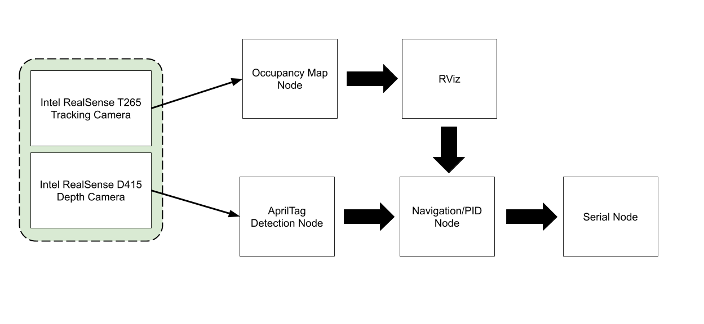
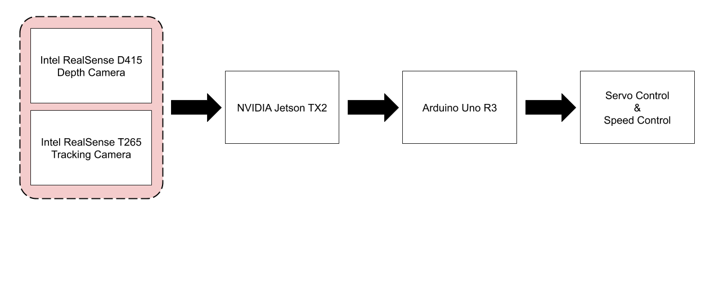

# Team28: Mars Rover Autonomous Navigation

<b>Team:</b> SeungYeun "Kelly" Lee, Linden Vo, Daniel Crawley, Brian He, Tommy Lam

<b>Client:</b> Osama Alshaykh

#### Contents

1. [Vision and Goals Of The Project](#vision-goals)
2. [Users/Personas Of The Project](#users-personas)
3. [Solution Concept](#solution-concept)
4. [Current State Of The Project](#current-state)
5. [Advice For Future Team](#advice)

<a name="vision-goals"/>

## 1. Vision and Goals Of The Project

Design, build, integrate, and test a rover capable of autonomous movement to a specified AprilTag with the use of GPS, visual and inertial navigation. 
* Perform simultaneous localization and mapping to find a path to an AprilTag
* Ability to robustly search for AprilTag when it is not found by the rover
* Ability to traverse rough terrain and avoid obstacles
* Ability to move to a specified GPS coordinate

*<b>Note: </b>Our project was initially defined by autonomous navigation part of [NASA’s University Mars Rover Challenge](https://7aec5dcb-a-3f6a8980-s-sites.googlegroups.com/a/marssociety.org/urc/files/University%20Rover%20Challenge%20Rules%202020.pdf?attachauth=ANoY7cpLqkXuYQCD0uW64Q3HTPOaNsRQ05ab-AumhtX_F_jY3DKxqUJM-x4Eevf3YLeGNm7ehF8cQKKQOMAAetMp6pzvBHyMh7tyg5-fsObt9LNl5b00d6K5aWYfG4I5T_6Thz2nkoM3BvNwU9fTXOYXqDuqfkUqFQ2ezP3MInWR-0SnoFmCFno-WXadJWFOj2gOniuh-mOHi7fwkgxKzHJtl96PwQHzfYQHPCELA0y0VJM53lxDdy7BKkZoUYM0guwFLp7G7OOM&attredirects=0); however, for the purpose of senior design, we worked with the client to re-define some requirements to reach a more attainable goal. Our rover is not supposed to work on Mars but in similar terrain like Mars.*

<a name="users-personas"/>

## 2. Users/Personas Of The Project

Target Audience: 
* NASA’s University Mars Rover Challenge

<a name="solution-concept"/>

## 3. Solution Concept

#### Software

The entire software stack for our project was developed using ROS, or Robot Operating System, in a series of nodes publishing and subscribing topics to each other. Essentially, our software stack has four layers: the first layer is a serial node which writes to our ESCs for motor and servo control.The second layer consists of turning on our two Intel Realsense cameras and collecting video data to acquire the AprilTag and its coordinates. The third layer is a node which maps the environment around the rover in Rviz using the ROS slam-gmapping algorithm. The fourth and final layer is our crucial navigation node, which uses the ROS move-base package  to avoid obstacles and through a PID controller navigates toward our target AprilTag. For more complete information please see the [Software](./Software/) section.

#### Hardware

The Mars rover uses a hobby RC crawler setup with four wheels and suspension. An Arduino writes via serial to the ESC and servo motors, however the main computer on the system is the Jetson TX2. Incoming data from the two Intel Realsense cameras: the T265 Tracking Camera and the D415 Depth Camera, is fed to the Jetson TX2. A 7.2V LiPo battery powers the crawler while a 19V DC battery acts as a power supply for the rest of the system. For more complete information please see the [Hardware](./Hardware/) section.

<a name="current-state"/>

## 4. Current State Of The Project 
Before the project was halted, the team was able to complete the entire hardware design for the project. The majority of time remaining to be spent on the project was with finishing development of the software stack.

For the software stack the team was able to write successfully to the ESCs for motor and servo control. In addition, the team was able to manually drive the rover with telekey operation (WASD keys) via SSH. Both Intel Realsense Cameras were configured to obtain image data and output ROS topics. The depth camera was configured to acquire AprilTags and then output Position X,Y,Z and Orientation X,Y,Z coordinates. A PID control loop was developed for navigating towards the target AprilTag about a zero setpoint however it needed much more fine tuning.

Work on the remaining layers of the software stack included generating a map of the environment in Rviz using ROS’s slam-gmapping algorithm and connecting it to the fourth layer, a navigation node which would use ROS’s move-base algorithm to detect and avoid obstacles. Our end goal was to be able to click on a specified location in the map generated in Rviz and have the rover navigate to the specified point, acquire the AprilTag, and then proceed to navigate towards the AprilTag.

<a name="advice"/>

## 5. Advice For Future Team
* Learn ROS proficiently. It is important to understand how all the nodes work and how to write subscribers and publishers. It is also important to know how to run ROS program.
* If this is your first time working with Jetson TX2, we highly encourage you to check this [link](https://developer.nvidia.com/gtc/2020/video/s22653). It will help you get started. Working with Jetson TX2 may frustrate you, but take a deep breath and stay calm. 
* Before jumping into this project, fully understand our software stack in order to change/add nodes for the software stack. Understand what each node does, what data the node sends, what data the node receives, etc. 
* If you see errors that you don't understand when using Jetson TX2, you can google the error message, and find some solutions. However, some of them may not be reliable and outdated, so make sure to use reliable and recent solutions. 
* If you struggle getting off to the right start, divide the project into smaller modules. For example, begin with detecting and acquiring an AprilTag with just a camera, and then placing the camera on the vehicle without steering or obstacles. By dividing the software stack into separate parts or layers, it makes the overall problem easier to solve.
* Look for COTS (commercial off the shelf) parts rather than expensive, fancy tech. It saves you a lot of time and money trying to design and develop brand new solutions from scratch.
